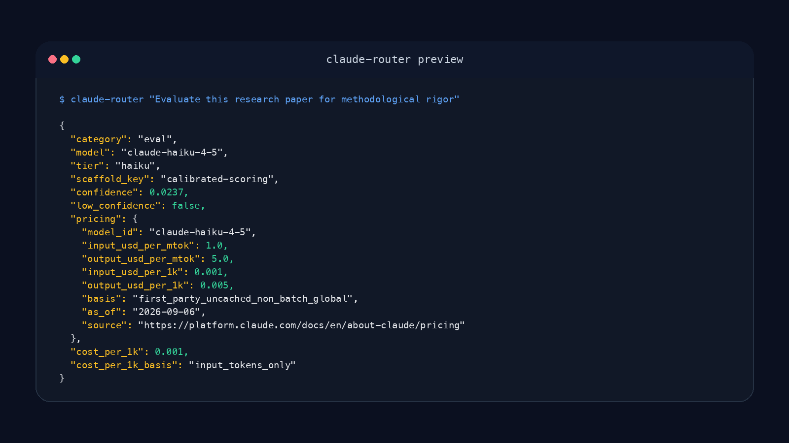

# claude-router

claude-router is a local prompt router that picks the right Claude model tier and prepends the right scaffold using local embeddings, before you call the API.

Claude teams overspend on Sonnet or Opus because nobody has a fast, repeatable way to decide when Haiku plus structure is enough. claude-router classifies a prompt locally, chooses the right Claude tier, and prepends the right scaffold when scaffolding actually improves quality.

- "We default to Sonnet for everything because nobody trusts routing by hand."
- "Some prompts need structure, but we keep discovering that too late."
- "We know Haiku is cheaper, but we do not know when it is safe."
- "Prompt reviews catch model-choice mistakes after the API bill already happened."

## Install

Requires: Python 3.10+, `requests`, `numpy`, and [Ollama](https://ollama.com) running locally with nomic-embed-text.

```bash
pip install claude-router
ollama pull nomic-embed-text
```

```python
from claude_router import ClaudeRouter

router = ClaudeRouter()
result = router.route("Evaluate this research paper for methodological rigor")
print(result["model"], result["scaffold_key"])
print(result["pricing"]["input_usd_per_mtok"], result["pricing"]["output_usd_per_mtok"])
```

```text
claude-haiku-4-5 calibrated-scoring
1.0 5.0
```

**When To Use It**

Use `claude-router` when you already call Claude models and want a local, deterministic routing layer for eval, research, content, and review prompts.

**When Not To Use It**

Do not use `claude-router` as a general agent framework, as proof that these exact routes transfer to your workload, or if you do not want an Ollama-based local classifier in the loop.



## Results

| Task | Best Setup | Run cost (2026-03) | Quality vs. Baseline |
|------|-----------|------|------------|
| Eval/scoring | Haiku + scaffold | $0.06 | MAE 1.0 (vs Sonnet raw: 1.2) |
| Research | Sonnet + scaffold | $0.28 | 8.49/10 (vs Opus raw: 7.45) |
| Content | Haiku + scaffold | $0.06 | 4/5 blind wins vs Sonnet |
| Code review | Sonnet (raw) | $0.28 | Sonnet raw preferred; scaffolds hurt coding |

Run costs are what these benchmark batches cost at the list prices in effect on their
2026-03 run dates. They are historical, not a forecast, and not current pricing — see
[Pricing](#pricing).

## Anti-findings

These are the blocker issues. The router handles them automatically:

- **Scaffolds break operational tasks** (0/9 success). Haiku treats constraints as meta-instructions instead of executing tasks.
- **Scaffolds hurt coding** (4.9 vs 6.4 raw). Don't scaffold code review, design, or debugging.
- **Opus doesn't scaffold**. Safety-critical evals need Opus raw (MAE 0.0), not scaffolded.

The routing table avoids these entirely: no scaffolds on operational, coding, safety-critical, or conversation tasks.

## Quick start

```python
from claude_router import ClaudeRouter

router = ClaudeRouter()
result = router.route("Evaluate this research paper for methodological rigor")

print(result["model"])           # claude-haiku-4-5
print(result["scaffold_key"])    # calibrated-scoring
print(result["pricing"])         # {'model_id': 'claude-haiku-4-5',
                                 #  'input_usd_per_mtok': 1.0, 'output_usd_per_mtok': 5.0,
                                 #  'input_usd_per_1k': 0.001, 'output_usd_per_1k': 0.005,
                                 #  'basis': 'first_party_uncached_non_batch_global',
                                 #  'as_of': '2026-09-06', 'source': 'https://platform.claude.com/...'}

# Build prompt with scaffold prepended
prompt = router.build_prompt("Evaluate this research paper...")
# → Pass prompt as system message to Anthropic API
```

Or CLI:

```bash
python router.py "Write a blog post about Q2 results"
```

## How it works

1. Embed your prompt using nomic-embed-text (~5ms)
2. Compare against pre-computed task-category centroids
3. Look up routing table: category → model + scaffold
4. Return model ID and scaffold text

No LLM calls for routing. All locally in ~10ms. When the classifier is not confident in a category, the router defaults to Opus.

## The 5 scaffolds

Each scaffold is validated through blind evaluation. They work by constraining the model's output space to the task structure.

See [scaffolds.json](scaffolds.json) for full text and evidence:

- **calibrated-scoring**: Integer 1-10, cite evidence, not generous/critical
- **insight-first**: Lead non-obvious, concrete recs, 3-4 sentences
- **plan-first**: g:goal;c:constraints;s:steps;r:risks prefix
- **substance-check**: Real gaps not surface, name issue and location
- **bug-hunt**: Specific bugs, line numbers, severity, one-line fix

## Routing table

```
eval              → Haiku   + calibrated-scoring
research          → Sonnet  + insight-first
content           → Haiku   + insight-first
analytical_review → Haiku   + substance-check
search            → Haiku   + plan-first

coding            → Sonnet  (raw)
operational       → Sonnet  (raw)
status_check      → Haiku   (raw)
conversation      → Opus    (raw)
safety_critical   → Opus    (raw)
```

Low confidence → Opus (safe default).

## Pricing

`route()` returns the routed model's exact list prices, with the date and source they
were read from, so you can do the arithmetic on your own token volumes:

| Tier | Model ID | Input $/MTok | Output $/MTok |
|------|----------|-------------:|--------------:|
| Haiku | `claude-haiku-4-5` | $1.00 | $5.00 |
| Sonnet | `claude-sonnet-4-6` | $3.00 | $15.00 |
| Opus | `claude-opus-4-6` | $5.00 | $25.00 |

Base (uncached, non-batch, global-inference) first-party Claude API prices as of
**2026-09-06**, from [platform.claude.com/docs/en/about-claude/pricing](https://platform.claude.com/docs/en/about-claude/pricing).
Prompt caching, the Batch API, and `inference_geo` all apply multipliers this table does
not model. The single maintained copy is [`src/claude_router/model_pricing.json`](src/claude_router/model_pricing.json),
read by both the packaged router and `router.py`.

This repo publishes no cost-savings total. What routing saves depends on your prompt mix
and, critically, on your input:output token ratio — output costs 5x input on every tier
above, so a savings figure computed from input price alone is wrong. Multiply your own
measured token counts by the two columns above.

`result["cost_per_1k"]` is still returned for existing consumers. It is **deprecated and
input-only** (`result["cost_per_1k_basis"] == "input_tokens_only"`): it is the input price
per 1K tokens and has never included output tokens. Use `result["pricing"]` for anything
that needs to be right.

## Customization

Swap scaffolds, centroids, or routing table:

```python
router = ClaudeRouter(
    centroids_path="my_centroids.json",
    routing_table_path="my_routing.json",
    scaffolds_path="my_scaffolds.json"
)
```

## Limitations

- Requires Ollama locally (for embeddings)
- Centroids trained on one task distribution — test on your workload
- The classifier is not perfect — ambiguous prompts fall to low confidence and default to Opus
- Anti-findings are real: scaffolds on coding/operational make things worse
- Prices are a dated snapshot, not a live feed — re-check `model_pricing.json` against the
  published source before relying on it for billing
- Lite mode (Haiku-first routing) planned for v1.1

## Evidence

Benchmarks: [benchmarks/](benchmarks/) | Raw citations: [scaffolds.json](scaffolds.json) | License: [MIT](LICENSE)

Key experiments: 4-condition code/research crossover, scaffolds-vs-operational stress test, scaffolded Sonnet beats Opus 75% on research (6/8 blind wins, 140 API calls).

Need this calibrated to your pipeline? [Open an issue](https://github.com/hermes-labs-ai/claude-router/issues) with the task categories and failure cases you want to benchmark.

---

## About Hermes Labs

[Hermes Labs](https://hermes-labs.ai) is an AI reliability engineering studio for product and engineering teams shipping production agents and LLM applications. We find the structural AI failures standard evals miss, then harden retrieval, memory, agents, and the language layers around production AI systems with runtime controls and defensible evidence.

Browse the [open-source catalog](https://hermes-labs.ai/open-source) or contact [roli@hermes-labs.ai](mailto:roli@hermes-labs.ai).
